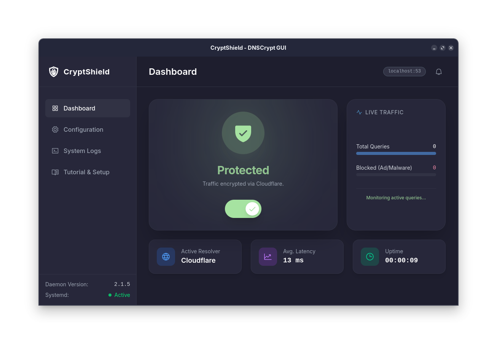

# CryptShield (DNSCrypt-GUI)

CryptShield is a modern, lightweight graphical user interface (GUI) for managing the `dnscrypt-proxy` daemon on Linux (specifically tailored for Fedora). It allows users to easily encrypt their DNS traffic, switch resolvers, and monitor system logs in real-time without ever touching the terminal or editing configuration files manually.

Built with **Tauri v2**, **React 19**, **TypeScript**, and **Tailwind CSS v4**.



## ✨ Features

- **One-Click Protection**: Start, stop, or restart the `dnscrypt-proxy` systemd service with automatic `pkexec` (Polkit) privilege escalation — only **1 password prompt** per action.
- **Live Traffic Monitor**: Real-time visualization of total DNS queries and blocked domains (ad/malware) directly parsed from the daemon's query logs.
- **System-Wide DNS Routing**: Automatically updates NetworkManager (`nmcli`) to route all system traffic through `127.0.0.1` when active.
- **Tutorial & Diagnostics**: Built-in dependency checker that verifies required packages (`dnscrypt-proxy`, `nmcli`, `pkexec`, `systemctl`) and provides copy-paste install commands if missing.
- **System Tray & Autostart**: Minimize to tray instead of closing. Optionally auto-launch on system login via the Configuration tab. Dynamic tray icon: colored when protected, dimmed when off.
- **Single Instance**: Prevents multiple copies of the application from running simultaneously, redirecting focus to the active window instead.
- **Easy Configuration**: Switch between 10 major resolvers via dropdown — no manual file editing needed.
- **Advanced Options**: Toggle DNS caching and DNSSEC enforcement with a simple switch.
- **Real-Time Logs**: View `journalctl` logs natively within the application.
- **Dark Mode First**: Catppuccin Mocha color palette with smooth animations and glow effects.

### 🌐 Supported Resolvers

| Resolver | Protocol | ECS Privacy | Notes |
|---|---|---|---|
| All Servers (Load Balanced) | Auto | Varies | Default — rotates across all available servers |
| Cloudflare | DoH/DNSCrypt | ✅ No ECS | Fast, privacy-focused |
| Google DNS | DoH/DNSCrypt | ❌ Sends ECS | Fastest, but forwards your subnet |
| Quad9 | DoH/DNSCrypt | ✅ No ECS | Malware blocking built-in |
| AdGuard DNS | DoH/DNSCrypt | ✅ No ECS | Ad & tracker blocking |
| NextDNS | DoH | ✅ No ECS | Customizable filtering |
| Cisco OpenDNS | DoH/DNSCrypt | ❌ Sends ECS | Enterprise-grade |
| Mullvad | DoH | ✅ No ECS | Maximum privacy, no logging |
| CleanBrowsing | DoH/DNSCrypt | ✅ No ECS | Family/adult content filter |
| TiarApp (BebasID) | DoH | ✅ No ECS | Indonesian server, ad blocking |

## 📦 Installation

### Option A: Install from RPM (Recommended for Fedora)

```bash
# Download the latest RPM from GitHub Releases
sudo dnf install ./cryptshield-0.1.4-1.x86_64.rpm
```

This will automatically install the required dependencies (`dnscrypt-proxy`, `NetworkManager`, `polkit`).

### Option B: Install from AppImage

```bash
# Download the AppImage from GitHub Releases
chmod +x CryptShield_0.1.4_amd64.AppImage
./CryptShield_0.1.4_amd64.AppImage
```

> **Note**: When using AppImage, you must manually install the dependencies first:
> ```bash
> sudo dnf install -y dnscrypt-proxy NetworkManager polkit
> ```

### Option C: Build from Source

1. **Install system dependencies**:
   ```bash
   sudo dnf install -y dnscrypt-proxy dbus-devel webkit2gtk4.1-devel librsvg2-devel
   ```

2. **Clone and install**:
   ```bash
   git clone https://github.com/fuadfaut/CryptShield.git
   cd CryptShield
   npm install
   ```

3. **Run in development mode**:
   ```bash
   npm run tauri dev
   ```

4. **Build production packages (RPM + AppImage)**:
   ```bash
   npm run tauri build
   ```
   Output will be in `src-tauri/target/release/bundle/`.

## 🚀 Quick Start

1. Open CryptShield (or find it in your system tray).
2. Go to **Tutorial & Setup** tab to verify all dependencies are installed.
3. Choose a resolver in the **Configuration** tab (default: Load Balanced).
4. Click the **power toggle** on the Dashboard — enter your password once.
5. Done! Your DNS traffic is now encrypted. Verify at [dnscheck.tools](https://dnscheck.tools).

> **Tip**: Enable "Run on Startup" in Configuration to have CryptShield protect your DNS automatically every time you log in.

---
**Current Version**: v0.1.4 (Beta)

## 🏗 Architecture

CryptShield is built using a secure, two-tier architecture:
- **Frontend (UI)**: A responsive single-page application built with React 19 and styled with Tailwind CSS v4. State is managed globally via Zustand.
- **Core Backend (Rust)**: Handles secure system operations via `std::process::Command` to invoke `systemctl` and `pkexec`, the `toml` crate for safely reading `/etc/dnscrypt-proxy/dnscrypt-proxy.toml`, and the `tokio` asynchronous runtime to stream journal and traffic logs without blocking the UI thread.

## 📄 License

This project is licensed under the MIT License.
